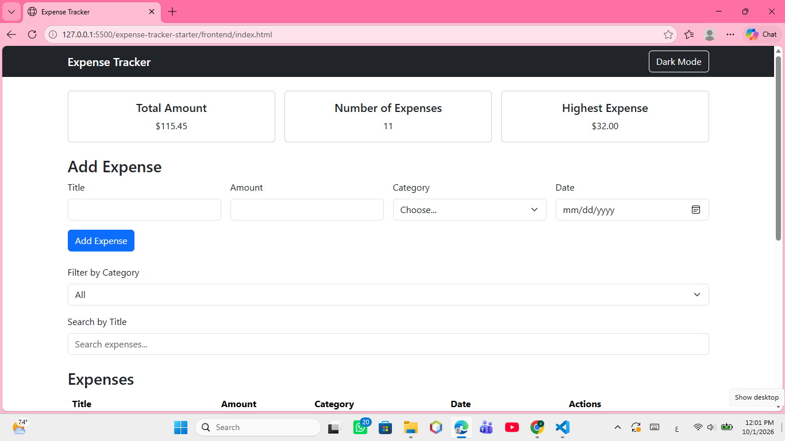
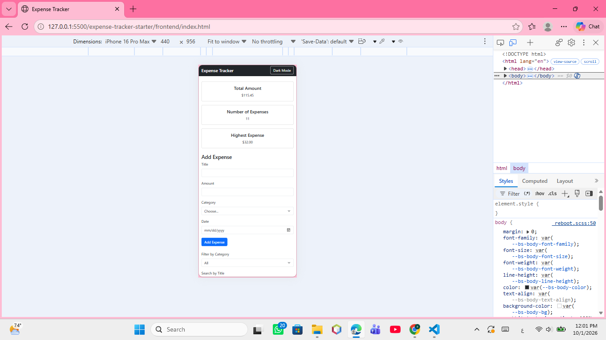

# Expense Tracker

A full-stack Expense Tracker application built using HTML, CSS, Bootstrap, JavaScript, Node.js, Express.js, and PostgreSQL.

## Features

- View all expenses
- Add a new expense
- Edit an existing expense
- Delete an expense
- Filter expenses by category
- Summary cards:
  - Total Amount
  - Number of Expenses
  - Highest Expense
- Form validation
- Loading spinner
- Success and error alerts
- Responsive design
- CSS Grid for summary cards
- Colored category badges

## Bonus Features

- Search expenses by title
- Dark Mode

## Technologies Used

### Frontend
- HTML
- CSS
- Bootstrap
- JavaScript
- Fetch API
- Async/Await

### Backend
- Node.js
- Express.js
- PostgreSQL
- CORS
- dotenv

## How to Run the Project

### 1. Create the Database

Create a PostgreSQL database named:

expense_tracker

### 2. Run the Database Schema

Open:

backend/schema.sql

Run the SQL script in PostgreSQL/pgAdmin to create the expenses table and sample data.

### 3. Configure Environment Variables

Inside the backend folder, create a `.env` file based on `.env.example`.

Add your own PostgreSQL configuration.

Do not share or upload the `.env` file.

### 4. Install Backend Dependencies

Open a terminal inside the backend folder and run:

npm install

### 5. Start the Backend Server

Run:

node server.js

The API will run on:

http://localhost:3000

### 6. Open the Frontend

Open:

frontend/index.html

Use Live Server in VS Code to run the frontend.

## API Endpoints

- GET `/api/expenses` - Get all expenses
- GET `/api/expenses/:id` - Get one expense
- POST `/api/expenses` - Add an expense
- PUT `/api/expenses/:id` - Update an expense
- DELETE `/api/expenses/:id` - Delete an expense

## Screenshots

### Desktop View

### Mobile View

## Challenges and Solution

One of the challenges was keeping the frontend synchronized with the database after adding, editing, or deleting an expense.

I solved this by fetching the expenses again from the server after each operation. This makes sure that the table and summary cards always display the latest data from PostgreSQL.

## Author

Shaimaa Al-Kharraz